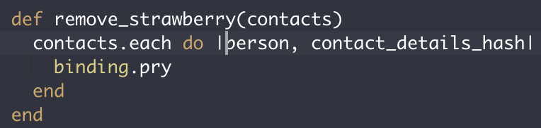
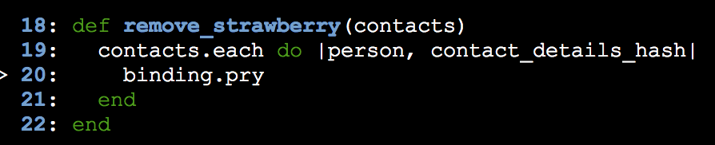

I've admittedly been avoiding `pry` since learning about it.

What is 'pry'? Pry is a type of REPL. REPL stands for _read, evaluate, print, loop_, and is an incredibly helpful program for debugging.

I was already familiar with IRB, the interactive ruby environment REPL that comes with Ruby, but apparently Pry had even more functionality. Can you believe?  

I didn't know, because well, I was avoiding it.

I understood that putting `require pry` at the top of a file and placing a `binding.pry` somewhere within a method did _something_ but I did not understand what it was that I needed to be looking for and deriving from what pry was showing me.

Last week, a ruby problem was causing me a lot of grief. I tried everything, ran the tests and it felt like no matter what I did the tests remained failing.

I realized this type of coding could not go on. Just running tests, crossing my fingers, praying for passing; and when it failed, not knowing which direction to head in.

I began using a browser REPL, cleverly titled [repl.it](https://repl.it/). It has been so helpful in playing around with code, trying different solutions and checking what's being returned. However even this REPL still wasn't cutting it. I couldn't always tell what the method was _doing_.

I realized I was going to have to once and for all, use and understand `pry`.

To call `pry`, you must place `require 'pry'` at the top of your .rb file and then place a `binding.pry` inside the method, where you would like to "peak into".

Once I ran pry and got here, pry displaying a copy of the method in the terminal, I was unsure what to do or what I was looking for. I then realized I can call on the values of the function and check if the function was properly ierating over them. Aha, finally things were making sense.

I won't attempt to explain in any further detail, as I still need to become more comfortable with using it to debug more often. However in addition to learning about pry, I learned that avoidance of topics I do not have a deep understanding in won't lead to success and understanding is just on the other side of fear.
